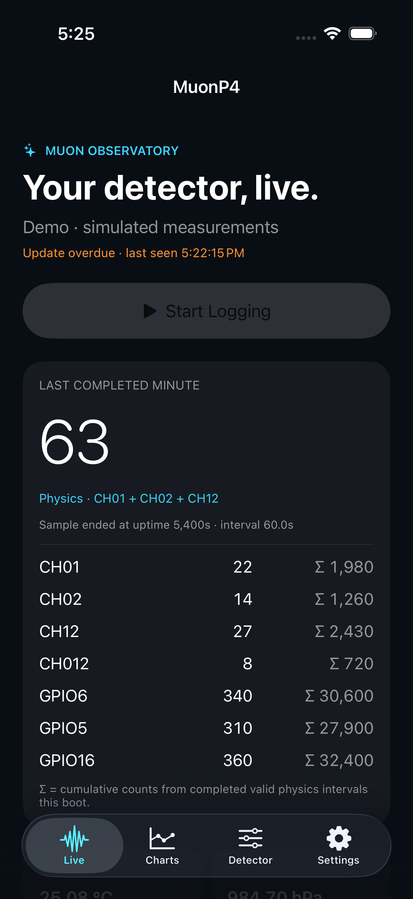
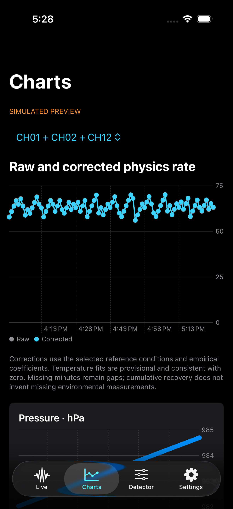

# ESP32-P4 gLOWCOST CubeSat Muon Readout

ESP-IDF firmware and a native iPhone companion for a gLOWCOST/MPPC cosmic-muon detector on the Waveshare ESP32-P4 Module DEV KIT.

## September 27: auditable records and phone recovery

- **Standalone detector logging stays independent of the phone.** Hardware identity is v2.2 with three connected paddles; the fourth channel is unconnected.
- **Every completed minute now records** DAC start/end codes, HV state, humidity, UTC/monotonic timing, last clock sync, raw and physics cumulative counts, radio state, quality flags, firmware SHA and FPGA hash.
- **Resumable recovery and GPS on SD:** the [iOS 2.1 app](https://github.com/muonTelescope/gLowCost-iOs) recovers verified records across reconnects/reboots and uploads GPS or explicitly assigned stationary locations to a separate SD companion file. Detector measurements remain immutable.
- **Temperature compensation stays in physics data**, flagged with the DAC changes. HV/Wi-Fi/manual-DAC transitions still restart qualification.

See the [schema, protocol, examples and limits](docs/RECORD-SCHEMA-5.md). Unsupported fourfold and physical HV readback are blank, not fabricated. Host tests and builds pass; this update has **not been flashed**, and end-to-end schema-5 testing on the detector/iPhone remains pending. The bundled `MuonMonitor/` source and screenshots below are the earlier companion; use the separate iOS repository for the current app.

## New features

- **Two-minute Wi-Fi setup:** 120 seconds without a connected Wi-Fi client, 100 ms AP beacons, and a **Start Physics Run** button in the web interface and iPhone app.
- **Explicit physics validity:** setup, HV transitions and settling are excluded from valid physics intervals. CSV rows retain raw counts and append validity, sequence, uptime, interval length, temperature and pressure.
- **Advertising plus a full Bluetooth connection:** `MuonP4` advertises about every 15 seconds, including while a phone is connected. Compact scan responses carry the three main coincidence counts, temperature, pressure and flags; the connection supplies all seven channels and exact 64-bit cumulative physics totals.
- **iPhone Live Activity and Dynamic Island:** press **Start Logging** while the app is open, wait for a connection, then monitor from the Lock Screen or Dynamic Island on supported iPhones. Stale updates are marked overdue.
- **Raw and corrected charts:** editable pressure and temperature coefficients, separate coincidence-pair fits, environmental plots and recent minute records. Gaps remain gaps; cumulative counters recover aggregate counts without inventing missing minute data.
- **Full detector controls over Bluetooth:** time sync, run labels, Wi-Fi power controls, HV, FPGA, DAC, environmental status, current/recent logs and previous SD-file downloads continue to work after Wi-Fi shuts down.
- **GPS and phone metadata:** local JSONL logs include location, fix age/accuracy, altitude, phone battery state and correction settings. GPS is never broadcast by the detector.

**Validation:** firmware, iPhone simulator and unsigned iPhone Release builds pass; shared C/Swift protocol tests pass. The screenshots below are native simulator captures with **synthetic data**, not a detector measurement. Physical P4 testing has verified boot, the 120-second Wi-Fi timeout, HV settling and Bluetooth telemetry after Wi-Fi shutdown. Encrypted controls, clock sync, manual Start Physics Run and Bluetooth SD-log downloads also pass. Physical iPhone testing remains pending. [Verification and hardware checks](docs/verification.md).

## iPhone preview

<table>
<tr><th>Live counts and cumulative totals</th><th>Raw and corrected charts</th></tr>
<tr>
<td></td>
<td></td>
</tr>
</table>

Open [MuonMonitor.xcodeproj](MuonMonitor/MuonMonitor.xcodeproj), choose a development team for both the app and its Live Activity extension, and build for an iPhone with iOS 17 or later. The detector needs matching protocol-v4 firmware. See the [iPhone guide and worked examples](docs/iphone-guide.md) for logging, corrections, Dynamic Island, GPS, controls and downloads.

## Typical run

1. Insert the SD card and power the detector.
2. Open the iPhone app and press **Start Logging**. Allow Bluetooth/GPS access and wait for the connection.
3. On **Detector**, sync phone time, set a run label and check FPGA, SD and HV status. The Wi-Fi page remains available at `http://192.168.4.1` during setup.
4. Press **Start Physics Run**, or allow 120 seconds without a Wi-Fi client. A Bluetooth connection does not keep Wi-Fi on.
5. HV cycles off, Wi-Fi stops, HV is restored after 3 seconds and settles for 10 seconds. A fresh complete minute is required before a physics-valid record appears.
6. Lock the phone to use the Live Activity; open **Charts** for raw/corrected rates. The detector's SD card remains the authoritative minute-by-minute record.
7. Export the phone log or download detector CSV files over Bluetooth. Keep the app foregrounded during controls and large downloads.

## Build and setup

Use ESP-IDF **5.5.4** with the checked-in configuration and dependency lockfile:

```sh
idf.py build
./tests/run-host-tests.sh
```

These commands build/test locally; they do not flash a device. See the [development guide](docs/developer-guide.md) for deployment commands and the hardware profile before installing a new image.

Wi-Fi setup: SSID **MuonReadout**, password **glowcost**, address **http://192.168.4.1**. **Keep Wi-Fi On** suspends automatic shutdown. Once stopped, Wi-Fi stays off until reboot.

## Current Hardware Profile

- Controller: Waveshare ESP32-P4 Module DEV KIT, tested on ESP32-P4 rev v1.3.
- Readout board: gLOWCOST/MPPC v2.2, hardware commit `677fb1b10999e2f20cf2f02e3deb845203625162`; three connected paddles, fourth analog channel unconnected.
- FPGA: iCE40 programmed from embedded `main/fpga.bin`.
- Active FPGA bitstream: `top_50MHz_led100_dt200_pi10us.bin` from the Oct-2025 readout repository.
- High voltage: MAX1932 controlled over SPI, startup byte `0xea`.
- DAC: DACx578 on I2C address `0x47`.
- Startup DAC values: channels 0-3 at `0x2f1`; threshold channels 4-7 at `0x070`.
- Environment sensor: optional BME280 on I2C `0x76` or `0x77`.
- Storage: onboard microSD card in SPI mode.
- Legacy S3-GEEK display source is retained in `display/`; its old decoder is not compatible with Bluetooth protocol v4.

## Web interface

The web UI provides SD readiness, counts, time, run labels, HV/FPGA/DAC controls and downloads. The image below is the **upstream web UI capture**; its older power-button wording predates Start Physics Run.


## Guides

- [iPhone features, setup and examples](docs/iphone-guide.md)
- [Bluetooth protocol v4 and command API](docs/bluetooth-protocol.md)
- [Detector operation](docs/operation-guide.md)
- [Data formats and SD logging](docs/data-format.md)
- [Build and development](docs/developer-guide.md)
- [Validation status and hardware acceptance checks](docs/verification.md)
- [Detector hardware sections](docs/detector-sections.md)
- [Threshold tuning results](docs/threshold-tuning-results.md)
- [Troubleshooting](docs/troubleshooting.md)

## Repository layout

| Path | Purpose |
|---|---|
| `main/` | P4 detector firmware, web UI, BLE telemetry and controls |
| `MuonMonitor/` | Native SwiftUI iPhone app, Live Activity extension and decoder tests |
| `tests/` | Host tests for physics intervals and C-to-Swift telemetry compatibility |
| `docs/` | Operating guides, protocol specification and screenshots |
| `display/s3-geek-ble-display/` | Legacy decoder source; not compatible with protocol v4 |
| `sdkconfig`, `sdkconfig.defaults`, `dependencies.lock` | Reproducible firmware configuration |

## Operating limits

`physics_valid` certifies the firmware's operating-state checks, not that Bluetooth RF interference has been experimentally ruled out. The separate C6 radio must support hosted BLE and concurrent advertising/connections; that combination still needs a hardware trial. Temperature corrections are provisional fits consistent with zero, not a universal calibration.

This detector controls high voltage. HV is switched off before FPGA reconfiguration and Wi-Fi shutdown, and counting is gated during settling. Turn HV off or power down before changing scintillator/SiPM connections. Bluetooth control uses encrypted Just Works pairing; it does not implement an owner-only access policy or authenticated MITM protection.
